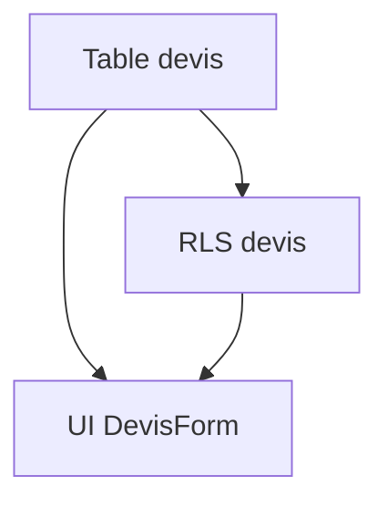

# /mockmig analyze

> **Phase 2 du workflow mockmig.** Audit de l'existant + gap analysis.

## Prérequis

- Phase DISCOVER complétée
- Gate A (validation) passée

## Arguments

| Argument | Requis | Description |
|----------|--------|-------------|
| Aucun | - | Utilise la session active |

## Exemple

```bash
/mockmig analyze
```

---

## Comportement

### Étape 1 : Charger la session

```
SI .mockmig/session.json n'existe pas:
  → ERREUR: "Aucune session active. Exécuter /mockmig init d'abord."
  → STOP

→ Charger session.json

SI phase != "DISCOVER":
  → AFFICHER: "Phase actuelle: <phase>"
  SI phase = "INIT":
    → AFFICHER: "→ Exécuter /mockmig discover d'abord"
  → STOP

SI gates.validate.passed != true:
  → ERREUR: "Gate A non passée. Corriger les erreurs de validation d'abord."
  → STOP
```

### Étape 2 : Audit existant via Supabase MCP

```
AFFICHER: "📋 Phase ANALYZE"
AFFICHER: "================"
AFFICHER: ""
AFFICHER: "🔍 Audit de l'existant via Supabase MCP..."

# Connexion Supabase
→ Vérifier connexion MCP Supabase
SI non connecté:
  → ERREUR: "Supabase MCP non connecté"
  → STOP

# Lire le schéma DB actuel
AFFICHER: "   Lecture du schéma DB..."
→ Supabase MCP: lister les tables
→ Pour chaque table: lister les colonnes, types, contraintes

AFFICHER: "   Tables existantes:"
POUR CHAQUE table:
  → AFFICHER: "      • <table> (<n> colonnes)"

# Lire les policies RLS
AFFICHER: "   Lecture des policies RLS..."
→ Supabase MCP: lister les policies par table

AFFICHER: "   Policies RLS:"
POUR CHAQUE policy:
  → AFFICHER: "      • <table>.<policy_name> (<operation>)"

# Lire les fonctions RPC
AFFICHER: "   Lecture des fonctions RPC..."
→ Supabase MCP: lister les fonctions

# Lire les triggers
AFFICHER: "   Lecture des triggers..."
→ Supabase MCP: lister les triggers

# Lire le code existant
AFFICHER: "   Analyse du code production..."
→ Lire app/src/modules/<module>/ si existe
→ Lire app/src/components/ pour composants partagés
→ Lire supabase/migrations/ pour historique
```

### Étape 3 : Générer 03_existing_audit.md

```
→ Créer migration/<module>/03_existing_audit.md

CONTENU:
---
# Audit existant: <module>

## Date
<now>

## Base de données

### Tables existantes
| Table | Colonnes | RLS | Description |
|-------|----------|-----|-------------|
| users | 5 | ✅ | Utilisateurs système |
| ... | ... | ... | ... |

### Tables absentes (requises par ontologie)
| Table | Concept ontologie | Priorité |
|-------|-------------------|----------|
| devis | Devis | P0 |
| ... | ... | ... |

### Policies RLS existantes
| Table | Policy | Opération | Pattern |
|-------|--------|-----------|---------|
| users | owner_select | SELECT | Owner |
| ... | ... | ... | ... |

### Policies RLS manquantes
| Table | Pattern requis | Priorité |
|-------|----------------|----------|
| devis | Owner | P0 |
| ... | ... | ... |

### Fonctions RPC
| Fonction | Description | Sécurité |
|----------|-------------|----------|
| ... | ... | SECURITY DEFINER |

## Code existant

### Modules
| Module | Chemin | Statut |
|--------|--------|--------|
| <module> | app/src/modules/<module>/ | ❌ N'existe pas |

### Composants partagés utilisables
| Composant | Chemin | Réutilisable |
|-----------|--------|--------------|
| AuthGuard | app/src/components/guards/ | ✅ |
| ... | ... | ... |

### Migrations Supabase
| Migration | Date | Description |
|-----------|------|-------------|
| 001_init | ... | ... |
| ... | ... | ... |

## Posture sécurité actuelle
- RLS: <activé/désactivé> par défaut
- Guards frontend: <présents/absents>
- Patterns détectés: <liste>
---

AFFICHER: "✅ Créé: migration/<module>/03_existing_audit.md"
```

### Étape 4 : Gap Analysis

```
AFFICHER: ""
AFFICHER: "📊 Gap Analysis..."

# Comparer ontologie vs existant
→ Lire ontologie/02_ontologie.yaml
→ Comparer concepts vs tables existantes
→ Comparer relations vs foreign keys
→ Comparer invariants vs constraints/triggers

# Comparer maquette vs existant
→ Lire 01_business_rules.md
→ Identifier règles non implémentées

# Classer les écarts
gaps = {
  P0: [],  # Critique - bloque le fonctionnement
  P1: [],  # Important - fonctionnalité dégradée
  P2: []   # Nice-to-have - amélioration
}

# DB gaps
POUR CHAQUE concept non implémenté:
  → gaps.P0.push({type: "DB", desc: "Créer table <table>"})

POUR CHAQUE policy RLS manquante:
  → gaps.P0.push({type: "RLS", desc: "Créer policy <policy>"})

# API gaps
POUR CHAQUE fonction RPC manquante:
  → gaps.P1.push({type: "RPC", desc: "Créer fonction <fn>"})

# UI gaps
POUR CHAQUE composant à migrer:
  → gaps.P1.push({type: "UI", desc: "Migrer <composant>"})

# Index/perf gaps
POUR CHAQUE index recommandé:
  → gaps.P2.push({type: "INDEX", desc: "Créer index <idx>"})

AFFICHER: "   P0 (Critique): <n> écarts"
AFFICHER: "   P1 (Important): <n> écarts"
AFFICHER: "   P2 (Nice-to-have): <n> écarts"
```

### Étape 5 : Générer 04_gap_analysis.md

```
→ Créer migration/<module>/04_gap_analysis.md

CONTENU:
---
# Gap Analysis: <module>

## Résumé
| Priorité | Nombre | Effort estimé |
|----------|--------|---------------|
| P0 | <n> | <x>h |
| P1 | <n> | <x>h |
| P2 | <n> | <x>h |
| **Total** | <n> | <x>h |

## Écarts P0 (Critiques)

### Base de données
| ID | Type | Description | Ontologie ref |
|----|------|-------------|---------------|
| GAP-001 | TABLE | Créer table `devis` | Devis |
| GAP-002 | RLS | Créer policy owner sur `devis` | INV-DEVIS-002 |
| ... | ... | ... | ... |

### Sécurité
| ID | Type | Description | Pattern |
|----|------|-------------|---------|
| GAP-xxx | GUARD | Ajouter ModuleAccessGuard | ModuleAccess |
| ... | ... | ... | ... |

## Écarts P1 (Importants)

### API/RPC
| ID | Type | Description | Règle métier |
|----|------|-------------|--------------|
| GAP-xxx | RPC | Créer lock_devis_on_send | BR-003 |
| ... | ... | ... | ... |

### UI
| ID | Type | Description | Composant source |
|----|------|-------------|------------------|
| GAP-xxx | MIGRATE | DevisForm.tsx | maquette/src/components/ |
| ... | ... | ... | ... |

## Écarts P2 (Nice-to-have)

### Performance
| ID | Type | Description | Impact |
|----|------|-------------|--------|
| GAP-xxx | INDEX | Index sur devis.user_id | Query perf |
| ... | ... | ... | ... |

## Dépendances entre écarts


## Risques identifiés
| Risque | Impact | Mitigation |
|--------|--------|------------|
| ... | ... | ... |
---

AFFICHER: "✅ Créé: migration/<module>/04_gap_analysis.md"
```

### Étape 6 : Mettre à jour session

```
→ Mettre à jour .mockmig/session.json:
  - phase: "ANALYZE"
  - artifacts.03_existing_audit.status: "done"
  - artifacts.04_gap_analysis.status: "done"
  - updatedAt: <now>
  - lastCommand: "/mockmig analyze"
```

### Étape 7 : Résultat et prochaine étape

```
AFFICHER: ""
AFFICHER: "═══════════════════════════════════════"
AFFICHER: "📋 Phase ANALYZE terminée"
AFFICHER: ""
AFFICHER: "Artefacts générés:"
AFFICHER: "   • migration/<module>/03_existing_audit.md"
AFFICHER: "   • migration/<module>/04_gap_analysis.md"
AFFICHER: ""
AFFICHER: "Résumé des écarts:"
AFFICHER: "   • P0 (Critique): <n>"
AFFICHER: "   • P1 (Important): <n>"
AFFICHER: "   • P2 (Nice-to-have): <n>"
AFFICHER: ""
AFFICHER: "→ Réviser les artefacts puis exécuter:"
AFFICHER: "  /mockmig plan"
```

---

## Artefacts créés

| Fichier | Description |
|---------|-------------|
| `migration/<module>/03_existing_audit.md` | Audit de l'existant |
| `migration/<module>/04_gap_analysis.md` | Analyse des écarts |

---

## Voir aussi

- `/mockmig discover` — Étape précédente
- `/mockmig plan` — Prochaine étape
- `/mockmig status` — Voir l'état de la session
