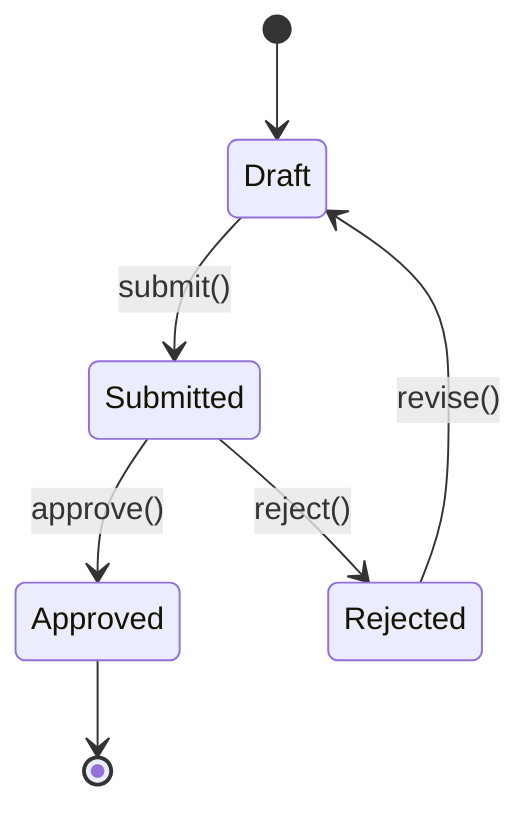

# /mockmig discover

> **Phase 1 du workflow mockmig.** Inspection exhaustive multi-niveaux + inventaire des règles métier.

## Prérequis

- Session active (exécuter `/mockmig init` d'abord)
- Sources de vérité présentes (constitution, sécurité, ontologie)

## Arguments

| Argument | Requis | Description |
|----------|--------|-------------|
| `--skip-validation` | ❌ | Ignorer la validation contre les sources de vérité |
| `--deep` | ❌ | Inspection encore plus profonde (analyse AST) |

## Exemple

```bash
/mockmig discover
/mockmig discover --deep
```

---

## Comportement

### Étape 1 : Charger la session

```
SI .mockmig/session.json n'existe pas:
  → ERREUR: "Aucune session active. Exécuter /mockmig init d'abord."
  → STOP

→ Charger session.json
→ Vérifier phase = "INIT"

SI phase != "INIT":
  → AFFICHER: "Session en phase <phase>."
  → AFFICHER: "Utiliser /mockmig status pour voir l'état."
  → DEMANDER: "Revenir à la phase DISCOVER? [o/N]"
  SI réponse != o:
    → STOP
```

### Étape 2 : Lire les sources de vérité

```
AFFICHER: "📚 Chargement des sources de vérité..."

→ Lire memory/constitution.md
  → Extraire les principes clés
  → Identifier les contraintes non-négociables

→ Lire security/ARCHITECTURE_DE_SECURITÉ.md
  → Extraire les patterns RLS (Owner, Team, Admin, Module, Soft-delete)
  → Extraire les guards requis
  → Identifier les anti-patterns à éviter

→ Lire ontologie/01_ontologie.md
  → Comprendre le contexte narratif
  → Identifier le vocabulaire métier

→ Lire ontologie/02_ontologie.yaml
  → Parser les concepts (entités)
  → Parser les relations (1:N, N:M, etc.)
  → Parser les invariants (règles)
  → Parser les enums (états, statuts)

AFFICHER: "✅ Sources de vérité chargées"
AFFICHER: "   • Constitution: <n> principes"
AFFICHER: "   • Sécurité: <n> patterns RLS, <n> anti-patterns"
AFFICHER: "   • Ontologie: <n> concepts, <n> relations, <n> invariants"
```

---

## 🔍 INSPECTION MULTI-NIVEAUX

> **CRITIQUE**: Cette inspection doit être EXHAUSTIVE. Ne rien manquer.

### Niveau 1 : Structure & Architecture

```
AFFICHER: ""
AFFICHER: "═══════════════════════════════════════"
AFFICHER: "🔍 NIVEAU 1: Structure & Architecture"
AFFICHER: "═══════════════════════════════════════"

mockupPath = session.mockupPath

# 1.1 - Arborescence complète
→ Lister TOUS les fichiers et dossiers
→ Identifier la structure:
  - /src ou /app ?
  - /components, /pages, /hooks, /lib, /utils ?
  - /types, /schemas, /models ?
  - /api, /services ?
  - /styles, /assets ?

AFFICHER: "📁 Arborescence:"
→ Afficher l'arbre (max 3 niveaux)

# 1.2 - Fichiers de configuration
→ Chercher et analyser:
  - package.json (dépendances, scripts)
  - tsconfig.json (config TypeScript)
  - tailwind.config.js (thème, plugins)
  - next.config.js (config Next.js)
  - .env.example (variables d'environnement)

AFFICHER: "⚙️  Configuration:"
AFFICHER: "   • Package: <name>@<version>"
AFFICHER: "   • TypeScript: <strict mode? paths?>"
AFFICHER: "   • Env vars: <liste des variables>"

# 1.3 - Points d'entrée
→ Identifier:
  - Layout principal
  - Pages/routes
  - App entry point

AFFICHER: "🚪 Points d'entrée: <n> pages/routes"
```

### Niveau 2 : Composants React

```
AFFICHER: ""
AFFICHER: "═══════════════════════════════════════"
AFFICHER: "🔍 NIVEAU 2: Composants React"
AFFICHER: "═══════════════════════════════════════"

# 2.1 - Inventaire des composants
→ Glob: **/*.{tsx,jsx}
→ POUR CHAQUE fichier:
  → Parser le code
  → Identifier:
    - Nom du composant (export default, named export)
    - Type (Page, Layout, Component, Provider)
    - Props (avec types)
    - Children (composition)

components = []

AFFICHER: "📦 Composants détectés: <n>"

# 2.2 - Hiérarchie des composants
→ Analyser les imports entre composants
→ Construire l'arbre de dépendances
→ Identifier:
  - Composants racine (pages)
  - Composants partagés (utilisés >1 fois)
  - Composants feuille (pas d'enfants)

AFFICHER: "🌳 Hiérarchie:"
→ Afficher l'arbre de composition

# 2.3 - Props Analysis
POUR CHAQUE composant:
  → Extraire les props:
    - Nom
    - Type (string, number, boolean, object, function, ReactNode)
    - Requis ou optionnel
    - Valeur par défaut
    - Callbacks (onClick, onChange, onSubmit)

AFFICHER: "🔧 Props complexes détectées:"
→ Lister les composants avec >3 props ou props complexes

# 2.4 - Patterns de composants
→ Détecter:
  - Compound components (Menu.Item, Form.Field)
  - Render props
  - HOCs (withAuth, withLayout)
  - Forwarded refs
  - Controlled vs Uncontrolled

AFFICHER: "🎨 Patterns:"
→ Lister les patterns détectés
```

### Niveau 3 : État & Data Management

```
AFFICHER: ""
AFFICHER: "═══════════════════════════════════════"
AFFICHER: "🔍 NIVEAU 3: État & Data Management"
AFFICHER: "═══════════════════════════════════════"

# 3.1 - Hooks React utilisés
→ Chercher tous les appels à:
  - useState → état local
  - useReducer → état complexe
  - useContext → état partagé
  - useRef → références
  - useMemo, useCallback → optimisations
  - useEffect → effets de bord

AFFICHER: "🪝 Hooks React:"
AFFICHER: "   • useState: <n> usages"
AFFICHER: "   • useContext: <n> usages"
AFFICHER: "   • useEffect: <n> usages"
→ etc.

# 3.2 - Custom Hooks
→ Chercher les fichiers use*.ts
→ Analyser chaque hook:
  - Nom
  - Paramètres
  - Retour
  - Dépendances (autres hooks appelés)

AFFICHER: "🎣 Custom Hooks: <n>"
POUR CHAQUE hook:
  → AFFICHER: "   • <useName>(<params>) → <return>"

# 3.3 - Context Providers
→ Chercher les createContext
→ Pour chaque context:
  - Nom
  - Shape (structure des données)
  - Provider location
  - Consumers (qui l'utilise)

AFFICHER: "🌐 Contexts: <n>"
POUR CHAQUE context:
  → AFFICHER: "   • <ContextName>: <shape résumé>"

# 3.4 - State Management externe
→ Détecter:
  - Zustand (create, useStore)
  - Redux (@reduxjs/toolkit, useSelector, useDispatch)
  - Jotai (atom, useAtom)
  - Recoil (atom, selector)
  - TanStack Query (useQuery, useMutation)

SI state management détecté:
  → AFFICHER: "📦 Store: <library>"
  → Analyser la structure du store
  → Lister les actions/slices
```

### Niveau 4 : Types & Schémas

```
AFFICHER: ""
AFFICHER: "═══════════════════════════════════════"
AFFICHER: "🔍 NIVEAU 4: Types & Schémas"
AFFICHER: "═══════════════════════════════════════"

# 4.1 - Interfaces TypeScript
→ Chercher toutes les déclarations:
  - interface X { }
  - type X = { }
  - type X = A | B (unions)
  - type X = A & B (intersections)

types = []

POUR CHAQUE type/interface:
  → Extraire:
    - Nom
    - Champs (nom, type, optionnel?)
    - Extends/implements
    - Génériques

AFFICHER: "📐 Types/Interfaces: <n>"
→ Grouper par catégorie (entities, props, responses, etc.)

# 4.2 - Enums et constantes
→ Chercher:
  - enum Status { }
  - const STATUS = { } as const
  - type Status = 'draft' | 'active' | 'closed'

AFFICHER: "📊 Enums: <n>"
POUR CHAQUE enum:
  → AFFICHER: "   • <EnumName>: <valeurs>"

# 4.3 - Schémas de validation
→ Chercher:
  - Zod: z.object(), z.string(), etc.
  - Yup: yup.object(), yup.string(), etc.
  - Joi: Joi.object(), etc.

AFFICHER: "✅ Schémas de validation: <n>"
POUR CHAQUE schéma:
  → Extraire les contraintes:
    - min/max
    - regex/pattern
    - required/optional
    - custom validators
  → AFFICHER: "   • <schemaName>: <contraintes clés>"

# 4.4 - Mapping avec l'ontologie
→ Pour chaque type détecté:
  → Chercher correspondance dans ontologie
  → Identifier les différences

AFFICHER: "🔗 Mapping Types → Ontologie:"
→ Tableau de correspondance
→ Types sans correspondance (⚠️)
→ Concepts ontologie non représentés (⚠️)
```

### Niveau 5 : UI/UX & Formulaires

```
AFFICHER: ""
AFFICHER: "═══════════════════════════════════════"
AFFICHER: "🔍 NIVEAU 5: UI/UX & Formulaires"
AFFICHER: "═══════════════════════════════════════"

# 5.1 - Formulaires
→ Chercher:
  - <form> tags
  - react-hook-form (useForm, Controller)
  - Formik (useFormik, <Formik>)
  - Custom form handling

forms = []

POUR CHAQUE formulaire:
  → Extraire:
    - Champs (name, type, label)
    - Validations (required, min, max, pattern)
    - Actions (onSubmit, onReset)
    - Messages d'erreur

AFFICHER: "📝 Formulaires: <n>"
POUR CHAQUE form:
  → AFFICHER: "   • <FormName>: <n> champs"
  → Lister les champs importants

# 5.2 - Inputs & Controls
→ Inventorier tous les inputs:
  - text, email, password, number
  - select, radio, checkbox
  - textarea
  - date, time, datetime
  - file upload
  - custom inputs (autocomplete, rich text, etc.)

AFFICHER: "🎛️  Types d'inputs: <liste>"

# 5.3 - Validation côté client
→ Pour chaque champ:
  → Extraire les règles de validation
  → Identifier les messages d'erreur

AFFICHER: "🔒 Règles de validation:"
→ Résumé des patterns de validation

# 5.4 - Messages & Textes
→ Extraire TOUS les textes visibles:
  - Labels
  - Placeholders
  - Messages d'erreur
  - Messages de succès
  - Tooltips
  - Boutons (CTA)

AFFICHER: "💬 Textes UI: <n> chaînes détectées"
→ Identifier les textes métier importants

# 5.5 - Interactions utilisateur
→ Détecter:
  - onClick handlers
  - onSubmit handlers
  - Drag & drop
  - Modals/Dialogs
  - Toasts/Notifications
  - Navigation (redirects, links)

AFFICHER: "👆 Interactions: <n> handlers"
```

### Niveau 6 : Data Flow & API

```
AFFICHER: ""
AFFICHER: "═══════════════════════════════════════"
AFFICHER: "🔍 NIVEAU 6: Data Flow & API"
AFFICHER: "═══════════════════════════════════════"

# 6.1 - Appels Supabase
→ Chercher tous les appels:
  - supabase.from('table').select()
  - supabase.from('table').insert()
  - supabase.from('table').update()
  - supabase.from('table').delete()
  - supabase.rpc('function')
  - supabase.auth.*

api_calls = []

POUR CHAQUE appel:
  → Extraire:
    - Table/fonction
    - Opération (CRUD)
    - Filtres (.eq, .in, .match)
    - Relations (.select('*, relation(*)'))
    - Fichier source

AFFICHER: "🗄️  Appels Supabase: <n>"
→ Grouper par table
→ Lister les opérations par table

# 6.2 - Autres appels API
→ Chercher:
  - fetch()
  - axios
  - API routes Next.js (/api/*)
  - tRPC
  - GraphQL queries

AFFICHER: "🌐 Autres APIs: <n>"
→ Lister les endpoints

# 6.3 - Data fetching patterns
→ Identifier:
  - SSR (getServerSideProps)
  - SSG (getStaticProps)
  - ISR (revalidate)
  - Client-side (useEffect, SWR, React Query)
  - Real-time (subscriptions)

AFFICHER: "📡 Patterns de fetching:"
→ Lister les patterns utilisés

# 6.4 - Mutations & Side effects
→ Pour chaque mutation:
  - Quelle donnée est modifiée?
  - Quels effets secondaires? (invalidation cache, redirect, toast)
  - Gestion optimistic updates?

AFFICHER: "✏️  Mutations: <n>"
→ Lister les mutations critiques

# 6.5 - Real-time subscriptions
→ Chercher:
  - supabase.channel()
  - supabase.from().on()
  - WebSocket connections

SI subscriptions détectées:
  AFFICHER: "📺 Real-time: <n> subscriptions"
  → Lister les canaux/tables
```

### Niveau 7 : Sécurité & Auth

```
AFFICHER: ""
AFFICHER: "═══════════════════════════════════════"
AFFICHER: "🔍 NIVEAU 7: Sécurité & Authentification"
AFFICHER: "═══════════════════════════════════════"

# 7.1 - Authentification
→ Chercher:
  - supabase.auth.signIn/signUp/signOut
  - useAuth, useUser, useSession
  - AuthProvider, SessionProvider
  - Cookies/localStorage pour tokens

AFFICHER: "🔐 Auth:"
→ Méthodes de login détectées (email, OAuth, etc.)
→ Gestion de session

# 7.2 - Guards & Protection
→ Chercher:
  - ProtectedRoute, AuthGuard
  - middleware.ts (Next.js)
  - Vérifications if (!user) redirect
  - HOCs withAuth

AFFICHER: "🛡️  Guards: <n>"
POUR CHAQUE guard:
  → AFFICHER: "   • <GuardName>: <condition>"

# 7.3 - Vérifications de rôles
→ Chercher:
  - role === 'admin'
  - hasPermission('write')
  - user.role, user.permissions
  - RBAC patterns

AFFICHER: "👤 Rôles détectés:"
→ Lister les rôles/permissions utilisés

# 7.4 - Patterns RLS implicites
→ Analyser les requêtes pour déduire les patterns:
  - .eq('user_id', user.id) → Owner pattern
  - .eq('team_id', ...) → Team pattern
  - .eq('company_id', ...) → Module pattern

AFFICHER: "🔒 Patterns RLS implicites:"
→ Mapper aux patterns de sécurité

# 7.5 - Données sensibles
→ Chercher:
  - Mots de passe (même masqués)
  - Tokens, API keys
  - Données personnelles (email, phone, address)
  - Données financières

AFFICHER: "⚠️  Données sensibles détectées:"
→ Lister et alerter
```

### Niveau 8 : Logique Métier

```
AFFICHER: ""
AFFICHER: "═══════════════════════════════════════"
AFFICHER: "🔍 NIVEAU 8: Logique Métier"
AFFICHER: "═══════════════════════════════════════"

# 8.1 - Conditions métier
→ Analyser TOUTES les conditions:
  - if/else
  - switch/case
  - Ternaires
  - && / || logiques

POUR CHAQUE condition:
  → Déterminer si c'est une règle métier
  → Extraire la règle en langage naturel

AFFICHER: "📋 Conditions métier: <n>"

# 8.2 - Calculs
→ Chercher:
  - Opérations mathématiques
  - Agrégations (sum, avg, count)
  - Formules (prix, taxes, totaux)

AFFICHER: "🧮 Calculs:"
→ Lister les formules importantes

# 8.3 - Transitions d'état
→ Identifier les machines à états implicites:
  - status: draft → submitted → approved → rejected
  - Boutons qui changent l'état
  - Workflows

AFFICHER: "🔄 Transitions d'état:"
→ Diagramme des états possibles

# 8.4 - Règles de validation métier
→ Au-delà de la validation technique:
  - "Le montant doit être > 0"
  - "La date de fin doit être après la date de début"
  - "Seul le créateur peut modifier"

AFFICHER: "✅ Règles de validation métier: <n>"

# 8.5 - TODO/FIXME/HACK
→ Chercher tous les commentaires:
  - // TODO:
  - // FIXME:
  - // HACK:
  - // NOTE:
  - // BUG:

AFFICHER: "📌 Notes développeur: <n>"
→ Lister les TODOs importants (règles manquantes?)

# 8.6 - Messages d'erreur métier
→ Extraire les messages d'erreur qui révèlent des règles:
  - "Vous n'êtes pas autorisé..."
  - "Le devis doit avoir au moins une ligne"
  - "Montant maximum dépassé"

AFFICHER: "❌ Messages d'erreur métier:"
→ Lister et déduire les règles
```

---

## Étape 3 : Synthèse des règles métier

```
AFFICHER: ""
AFFICHER: "═══════════════════════════════════════"
AFFICHER: "📋 SYNTHÈSE DES RÈGLES MÉTIER"
AFFICHER: "═══════════════════════════════════════"

# Consolider toutes les règles découvertes
→ Fusionner les règles des 8 niveaux
→ Dédupliquer
→ Catégoriser par priorité:

## P0 - Critiques (bloquantes)
  - Sécurité (accès, permissions)
  - Intégrité des données (contraintes DB)
  - Validation obligatoire

## P1 - Importantes (fonctionnelles)
  - Logique métier principale
  - Calculs
  - Workflows

## P2 - Nice-to-have (UX)
  - Validations de confort
  - Messages d'aide
  - Comportements optionnels

AFFICHER: "📊 Règles métier:"
AFFICHER: "   • P0 (Critiques): <n>"
AFFICHER: "   • P1 (Importantes): <n>"
AFFICHER: "   • P2 (Nice-to-have): <n>"
AFFICHER: "   • Total: <n>"
```

---

## Étape 4 : Générer les artefacts

### 00_context.md

```
→ Créer migration/<module>/00_context.md

CONTENU:
---
# Contexte de migration: <module>

## Informations générales
| Clé | Valeur |
|-----|--------|
| Module | <module> |
| Maquette | <mockupPath> |
| Date d'analyse | <now> |
| Analysé par | Claude Code |

## Stack technique
| Technologie | Version | Usage |
|-------------|---------|-------|
| Next.js | <version> | Framework |
| React | <version> | UI |
| TypeScript | <version> | Typage |
| Tailwind | <version> | Styling |
| Supabase | <version> | Backend |
| <autres> | ... | ... |

## Architecture
<diagramme ou description de l'architecture>

## Statistiques
| Métrique | Valeur |
|----------|--------|
| Fichiers analysés | <n> |
| Composants | <n> |
| Types/Interfaces | <n> |
| Hooks personnalisés | <n> |
| Appels API | <n> |
| Formulaires | <n> |

## Composants (Niveau 2)
<tableau des composants avec type et props>

## Types principaux (Niveau 4)
<tableau des types avec champs>

## Data flow (Niveau 6)
<description du flux de données>

## Dépendances critiques
<liste des dépendances importantes>
---

AFFICHER: "✅ Créé: migration/<module>/00_context.md"
```

### 01_business_rules.md

```
→ Créer migration/<module>/01_business_rules.md

CONTENU:
---
# Règles métier: <module>

## Vue d'ensemble
<description du module et son objectif>

## Inventaire complet

### Règles P0 (Critiques) - <n> règles
| ID | Règle | Source | Type | Validation |
|----|-------|--------|------|------------|
| BR-001 | <description> | <fichier:ligne> | Sécurité | RLS/Guard |
| BR-002 | ... | ... | Intégrité | Contrainte DB |

#### BR-001: <Titre>
- **Description**: <description complète>
- **Source**: `<fichier>` ligne <n>
- **Code source**:
  ```typescript
  <extrait de code>
  ```
- **Implémentation requise**: <RLS / Guard / Validation>
- **Priorité**: P0
- **Mapping ontologie**: <concept>.<invariant>

### Règles P1 (Importantes) - <n> règles
...

### Règles P2 (Nice-to-have) - <n> règles
...

## Mapping Règles → Ontologie
| Règle | Concept | Invariant | Statut |
|-------|---------|-----------|--------|
| BR-001 | Devis | INV-001 | ✅ Aligné |
| BR-005 | - | - | ⚠️ Non couvert |

## Règles nécessitant mise à jour ontologie
<liste des règles non couvertes>

## Diagramme des transitions d'état


## Formules et calculs
| Calcul | Formule | Utilisé dans |
|--------|---------|--------------|
| Total HT | Σ(qté × prix) | DevisTotal |
| TVA | total_ht × taux_tva | DevisTotal |
---

AFFICHER: "✅ Créé: migration/<module>/01_business_rules.md"
```

### 02_validation_packet.md

```
→ Créer migration/<module>/02_validation_packet.md

# (contenu similaire à avant mais enrichi)

AFFICHER: "✅ Créé: migration/<module>/02_validation_packet.md"
```

---

## Étape 5 : Validation contre sources de vérité

```
SI --skip-validation:
  → AFFICHER: "⏭️  Validation ignorée (--skip-validation)"
  → GOTO Étape 6

AFFICHER: ""
AFFICHER: "═══════════════════════════════════════"
AFFICHER: "🔒 VALIDATION CONTRE SOURCES DE VÉRITÉ"
AFFICHER: "═══════════════════════════════════════"

# Constitution
AFFICHER: "📜 Constitution..."
→ Vérifier chaque principe
→ Reporter les violations

# Sécurité
AFFICHER: "🛡️  Sécurité..."
→ Vérifier les patterns RLS
→ Vérifier les anti-patterns
→ Reporter les violations

# Ontologie
AFFICHER: "📊 Ontologie..."
→ Vérifier les concepts
→ Vérifier les relations
→ Vérifier les invariants
→ Reporter les violations

# Résultat
SI erreurs critiques:
  → AFFICHER: "❌ VALIDATION ÉCHOUÉE"
  → gates.validate.passed = false
SINON SI warnings:
  → AFFICHER: "⚠️  VALIDATION AVEC WARNINGS"
  → gates.validate.passed = true
SINON:
  → AFFICHER: "✅ VALIDATION RÉUSSIE"
  → gates.validate.passed = true
```

---

## Étape 6 : Mettre à jour session et conclure

```
→ Mettre à jour .mockmig/session.json:
  - phase: "DISCOVER"
  - artifacts.00_context.status: "done"
  - artifacts.01_business_rules.status: "done"
  - artifacts.02_validation_packet.status: "done"
  - gates.validate.passed: <result>
  - gates.validate.date: <now>
  - stats: {
      files_analyzed: <n>,
      components: <n>,
      types: <n>,
      hooks: <n>,
      api_calls: <n>,
      business_rules: <n>
    }

AFFICHER: ""
AFFICHER: "═══════════════════════════════════════"
AFFICHER: "📋 PHASE DISCOVER TERMINÉE"
AFFICHER: "═══════════════════════════════════════"
AFFICHER: ""
AFFICHER: "Analyse effectuée:"
AFFICHER: "   • <n> fichiers analysés"
AFFICHER: "   • <n> composants détectés"
AFFICHER: "   • <n> types/interfaces"
AFFICHER: "   • <n> règles métier extraites"
AFFICHER: ""
AFFICHER: "Artefacts générés:"
AFFICHER: "   • migration/<module>/00_context.md"
AFFICHER: "   • migration/<module>/01_business_rules.md"
AFFICHER: "   • migration/<module>/02_validation_packet.md"
AFFICHER: ""

SI gates.validate.passed:
  AFFICHER: "[GATE A] ✅ Validation réussie"
  AFFICHER: ""
  AFFICHER: "→ Réviser les artefacts puis exécuter:"
  AFFICHER: "  /mockmig analyze"
SINON:
  AFFICHER: "[GATE A] ❌ Validation échouée"
  AFFICHER: ""
  AFFICHER: "→ Corriger les erreurs listées dans 02_validation_packet.md"
  AFFICHER: "→ Puis relancer: /mockmig discover"
```

---

## Artefacts créés

| Fichier | Description |
|---------|-------------|
| `migration/<module>/00_context.md` | Contexte complet et métadonnées |
| `migration/<module>/01_business_rules.md` | Catalogue exhaustif des règles métier |
| `migration/<module>/02_validation_packet.md` | Résultat de validation |

---

## Checklist de complétude

Avant de passer à la phase suivante, vérifier:

- [ ] Tous les composants ont été analysés
- [ ] Tous les types sont documentés
- [ ] Toutes les règles métier sont extraites
- [ ] Les patterns RLS sont identifiés
- [ ] Les calculs/formules sont documentés
- [ ] Les transitions d'état sont claires
- [ ] Le mapping avec l'ontologie est fait
- [ ] Les gaps ontologie sont listés

---

## Voir aussi

- `/mockmig init` — Étape précédente
- `/mockmig analyze` — Prochaine étape
- `/mockmig status` — Voir l'état de la session
