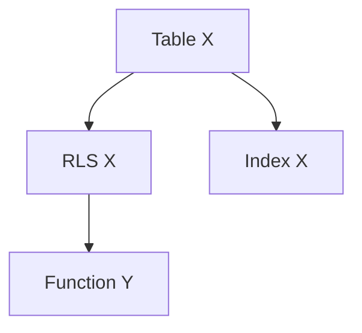

# /mockmig plan

> **Phase 3 du workflow mockmig.** Génération des tâches backend/UI + runbook.

## Prérequis

- Phase ANALYZE complétée
- Artefacts 03 et 04 générés

## Arguments

| Argument | Requis | Description |
|----------|--------|-------------|
| Aucun | - | Utilise la session active |

## Exemple

```bash
/mockmig plan
```

---

## Comportement

### Étape 1 : Charger la session

```
SI .mockmig/session.json n'existe pas:
  → ERREUR: "Aucune session active. Exécuter /mockmig init d'abord."
  → STOP

→ Charger session.json

SI phase != "ANALYZE":
  → AFFICHER: "Phase actuelle: <phase>"
  SI phase = "INIT":
    → AFFICHER: "→ Exécuter /mockmig discover d'abord"
  SI phase = "DISCOVER":
    → AFFICHER: "→ Exécuter /mockmig analyze d'abord"
  → STOP
```

### Étape 2 : Charger les artefacts précédents

```
AFFICHER: "📋 Phase PLAN"
AFFICHER: "============="
AFFICHER: ""
AFFICHER: "📖 Chargement des artefacts..."

→ Lire migration/<module>/01_business_rules.md
→ Lire migration/<module>/04_gap_analysis.md
→ Lire ontologie/02_ontologie.yaml

AFFICHER: "   ✓ Règles métier chargées"
AFFICHER: "   ✓ Gap analysis chargé"
AFFICHER: "   ✓ Ontologie chargée"
```

### Étape 3 : Générer les tâches Backend

```
AFFICHER: ""
AFFICHER: "🔧 Planification Backend..."

# Trier les gaps par priorité et dépendances
→ Lire les gaps P0 (critiques)
→ Ordonner selon dépendances (tables avant policies, etc.)

backend_tasks = []

# Tables
POUR CHAQUE gap type=TABLE:
  → Créer tâche: {
      id: "BE-<n>",
      type: "migration",
      priority: gap.priority,
      description: "Créer table <table>",
      sql: "-- Migration SQL généré depuis ontologie",
      depends_on: [],
      estimated_hours: <estimation>
    }

# Policies RLS
POUR CHAQUE gap type=RLS:
  → Créer tâche: {
      id: "BE-<n>",
      type: "rls",
      priority: gap.priority,
      description: "Créer policy <policy> sur <table>",
      pattern: "<pattern>",
      depends_on: ["BE-<table_task>"],
      estimated_hours: <estimation>
    }

# Fonctions RPC
POUR CHAQUE gap type=RPC:
  → Créer tâche: {
      id: "BE-<n>",
      type: "function",
      priority: gap.priority,
      description: "Créer fonction <fn>",
      business_rule: "<BR-xxx>",
      depends_on: [...],
      estimated_hours: <estimation>
    }

# Indexes
POUR CHAQUE gap type=INDEX:
  → Créer tâche: {
      id: "BE-<n>",
      type: "index",
      priority: "P2",
      description: "Créer index <idx>",
      depends_on: ["BE-<table_task>"],
      estimated_hours: <estimation>
    }

AFFICHER: "   Tâches Backend: <n>"
AFFICHER: "      • Migrations: <n>"
AFFICHER: "      • Policies RLS: <n>"
AFFICHER: "      • Fonctions: <n>"
AFFICHER: "      • Indexes: <n>"
```

### Étape 4 : Générer les tâches UI

```
AFFICHER: ""
AFFICHER: "🎨 Planification UI..."

ui_tasks = []

# Composants à migrer
POUR CHAQUE gap type=MIGRATE:
  → Analyser le composant source
  → Créer tâche: {
      id: "UI-<n>",
      type: "component",
      priority: gap.priority,
      description: "Migrer <composant>",
      source: "<mockup_path>",
      target: "app/src/modules/<module>/components/",
      depends_on: [...backend_tasks],
      estimated_hours: <estimation>
    }

# Pages/Routes
POUR CHAQUE page identifiée:
  → Créer tâche: {
      id: "UI-<n>",
      type: "page",
      priority: "P1",
      description: "Créer page <route>",
      route: "<path>",
      depends_on: ["UI-<components>"],
      estimated_hours: <estimation>
    }

# Guards
POUR CHAQUE gap type=GUARD:
  → Créer tâche: {
      id: "UI-<n>",
      type: "guard",
      priority: "P0",
      description: "Implémenter <guard>",
      pattern: "<pattern>",
      depends_on: [],
      estimated_hours: <estimation>
    }

AFFICHER: "   Tâches UI: <n>"
AFFICHER: "      • Composants: <n>"
AFFICHER: "      • Pages: <n>"
AFFICHER: "      • Guards: <n>"
```

### Étape 5 : Générer 05_backend_tasks.md

```
→ Créer migration/<module>/05_backend_tasks.md

CONTENU:
---
# Tâches Backend: <module>

## Résumé
| Type | Nombre | Effort |
|------|--------|--------|
| Migration | <n> | <x>h |
| RLS | <n> | <x>h |
| Fonction | <n> | <x>h |
| Index | <n> | <x>h |
| **Total** | <n> | <x>h |

## Ordre d'exécution



## Tâches P0 (Critiques)

### BE-001: Créer table `<table>`
- **Type**: migration
- **Priorité**: P0
- **Dépend de**: -
- **Effort estimé**: <x>h
- **Gap ref**: GAP-001

```sql
-- Migration SQL
CREATE TABLE <table> (
    id UUID PRIMARY KEY DEFAULT gen_random_uuid(),
    ...
    created_at TIMESTAMPTZ DEFAULT now(),
    updated_at TIMESTAMPTZ DEFAULT now()
);

-- RLS
ALTER TABLE <table> ENABLE ROW LEVEL SECURITY;
```

### BE-002: Créer policy `<policy>`
...

## Tâches P1 (Importantes)
...

## Tâches P2 (Nice-to-have)
...

---

AFFICHER: "✅ Créé: migration/<module>/05_backend_tasks.md"
```

### Étape 6 : Générer 06_ui_tasks.md

```
→ Créer migration/<module>/06_ui_tasks.md

CONTENU:
---
# Tâches UI: <module>

## Résumé
| Type | Nombre | Effort |
|------|--------|--------|
| Composant | <n> | <x>h |
| Page | <n> | <x>h |
| Guard | <n> | <x>h |
| **Total** | <n> | <x>h |

## Architecture cible

```
app/src/modules/<module>/
├── components/
│   ├── <Component1>.tsx
│   └── <Component2>.tsx
├── pages/
│   ├── index.tsx
│   └── [id].tsx
├── hooks/
│   └── use<Module>.ts
└── types/
    └── index.ts
```

## Composants

### UI-001: Migrer `<Component>`
- **Type**: component
- **Priorité**: P1
- **Source**: maquette/src/components/<path>
- **Cible**: app/src/modules/<module>/components/
- **Dépend de**: BE-001, BE-002
- **Effort estimé**: <x>h

**Adaptations requises**:
- [ ] Remplacer mock data par Supabase query
- [ ] Ajouter guards d'accès
- [ ] Intégrer types générés
- [ ] Ajouter loading states

### UI-002: ...

## Pages

### UI-0xx: Créer page `/<route>`
...

## Guards

### UI-0xx: Implémenter `<Guard>`
- **Pattern**: ModuleAccess | RoleCheck | OwnerOnly
- **Fichier**: app/src/components/guards/<guard>.tsx

---

AFFICHER: "✅ Créé: migration/<module>/06_ui_tasks.md"
```

### Étape 7 : Générer 07_runbook.md

```
AFFICHER: ""
AFFICHER: "📜 Génération du Runbook..."

→ Créer migration/<module>/07_runbook.md

CONTENU:
---
# Runbook de Migration: <module>

## Informations générales

| Clé | Valeur |
|-----|--------|
| Module | <module> |
| Date de génération | <now> |
| Effort total estimé | <x>h |
| Nombre de tâches | <n> |

## Prérequis

- [ ] MCPs connectés (Supabase, GitHub, Netlify)
- [ ] Branch de migration créée
- [ ] Environnement de dev configuré

## Phases d'exécution

### Phase A: Infrastructure DB (P0)
**Durée estimée**: <x>h

1. [ ] BE-001: Créer table `<table>`
2. [ ] BE-002: Créer policy RLS
3. [ ] ...

**Validation**:
```sql
-- Vérifier que la table existe
SELECT * FROM information_schema.tables WHERE table_name = '<table>';

-- Vérifier RLS activé
SELECT relrowsecurity FROM pg_class WHERE relname = '<table>';
```

### Phase B: Backend Logic (P0-P1)
**Durée estimée**: <x>h

1. [ ] BE-0xx: Créer fonction `<fn>`
2. [ ] ...

**Validation**:
```sql
-- Tester la fonction
SELECT <fn>(...);
```

### Phase C: UI Migration (P1)
**Durée estimée**: <x>h

1. [ ] UI-001: Migrer `<Component>`
2. [ ] UI-002: ...
3. [ ] ...

**Validation**:
- [ ] Composants render sans erreur
- [ ] Données chargées depuis Supabase
- [ ] Guards fonctionnels

### Phase D: Optimisation (P2)
**Durée estimée**: <x>h

1. [ ] BE-0xx: Créer index
2. [ ] ...

## Rollback Plan

En cas de problème:

1. **DB**: Supprimer les migrations dans l'ordre inverse
   ```sql
   DROP TABLE IF EXISTS <table> CASCADE;
   ```

2. **Code**: Revert la branche
   ```bash
   git revert --no-commit <commit>..HEAD
   git commit -m "Rollback: <module> migration"
   ```

## Checklist Post-Migration

- [ ] Tests passent
- [ ] Pas d'erreurs console
- [ ] RLS testées (accès refusé pour mauvais user)
- [ ] Performance acceptable
- [ ] Documentation mise à jour

## Contacts

| Rôle | Nom |
|------|-----|
| Tech Lead | - |
| Product Owner | - |

---

AFFICHER: "✅ Créé: migration/<module>/07_runbook.md"
```

### Étape 8 : Gate B - Préparer le Sign-off

```
AFFICHER: ""
AFFICHER: "📋 Préparation Gate B (Sign-off)..."

→ Créer migration/<module>/SIGNOFF_CHECKLIST.md

CONTENU:
---
# Checklist de Sign-off: <module>

## Avant de procéder à l'exécution

Le Product Owner / Tech Lead doit valider:

### Scope
- [ ] Les règles métier (01_business_rules.md) sont correctes
- [ ] L'ontologie reflète bien le modèle attendu
- [ ] Aucune fonctionnalité n'est manquante

### Sécurité
- [ ] Les patterns RLS sont appropriés
- [ ] Les guards couvrent tous les cas d'accès
- [ ] Pas de données sensibles exposées

### Effort
- [ ] L'estimation d'effort est réaliste
- [ ] Les dépendances sont bien identifiées
- [ ] Le rollback plan est viable

### Risques
- [ ] Les risques identifiés sont acceptables
- [ ] Des mitigations sont en place

## Signature

| Rôle | Nom | Date | Signature |
|------|-----|------|-----------|
| Tech Lead | | | ☐ |
| Product Owner | | | ☐ |

---

AFFICHER: "✅ Créé: migration/<module>/SIGNOFF_CHECKLIST.md"
```

### Étape 9 : Mettre à jour session

```
→ Mettre à jour .mockmig/session.json:
  - phase: "PLAN"
  - artifacts.05_backend_tasks.status: "done"
  - artifacts.06_ui_tasks.status: "done"
  - artifacts.07_runbook.status: "done"
  - updatedAt: <now>
  - lastCommand: "/mockmig plan"
```

### Étape 10 : Résultat et prochaine étape

```
AFFICHER: ""
AFFICHER: "═══════════════════════════════════════"
AFFICHER: "📋 Phase PLAN terminée"
AFFICHER: ""
AFFICHER: "Artefacts générés:"
AFFICHER: "   • migration/<module>/05_backend_tasks.md"
AFFICHER: "   • migration/<module>/06_ui_tasks.md"
AFFICHER: "   • migration/<module>/07_runbook.md"
AFFICHER: "   • migration/<module>/SIGNOFF_CHECKLIST.md"
AFFICHER: ""
AFFICHER: "Résumé des tâches:"
AFFICHER: "   • Backend: <n> tâches (<x>h)"
AFFICHER: "   • UI: <n> tâches (<x>h)"
AFFICHER: "   • Total: <n> tâches (<x>h)"
AFFICHER: ""
AFFICHER: "⚠️  Gate B: Sign-off requis"
AFFICHER: "   Faire valider SIGNOFF_CHECKLIST.md avant d'exécuter."
AFFICHER: ""
AFFICHER: "→ Après validation, exécuter:"
AFFICHER: "  /mockmig execute --confirm"
```

---

## Artefacts créés

| Fichier | Description |
|---------|-------------|
| `migration/<module>/05_backend_tasks.md` | Tâches backend ordonnées |
| `migration/<module>/06_ui_tasks.md` | Tâches UI avec architecture |
| `migration/<module>/07_runbook.md` | Guide d'exécution complet |
| `migration/<module>/SIGNOFF_CHECKLIST.md` | Checklist Gate B |

---

## Voir aussi

- `/mockmig analyze` — Étape précédente
- `/mockmig execute` — Prochaine étape
- `/mockmig status` — Voir l'état de la session
