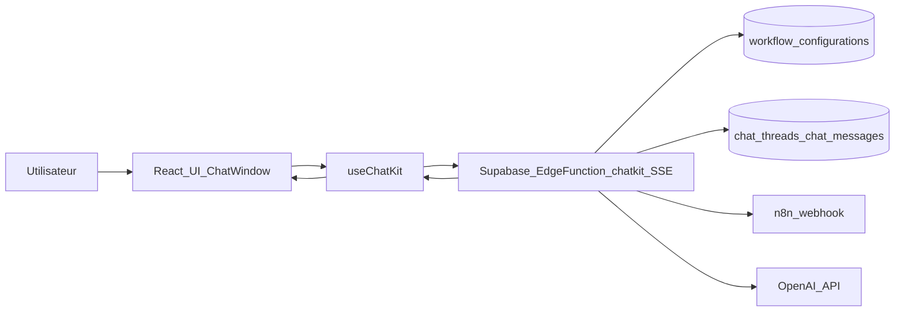
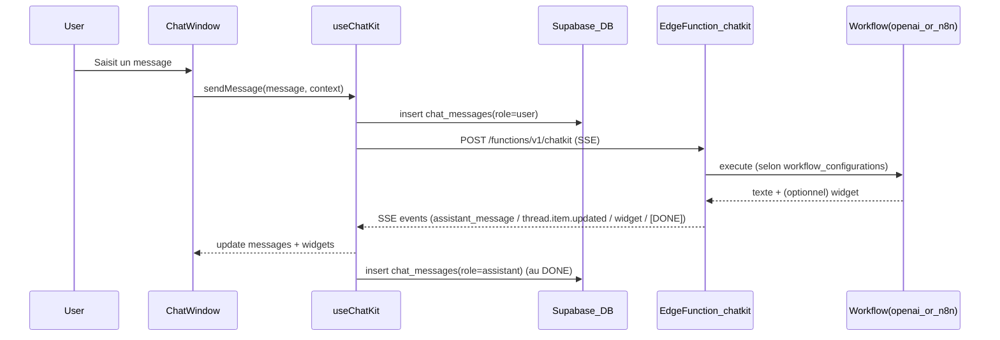

# 01 — Architecture (ChatWindow)

## Périmètre

Cette doc décrit **ChatWindow** (UI de chat) : conversation, widgets, stockage, workflows, et routeur SSE.

**Hors périmètre** : composant “ChatKit UI” (web component OpenAI) et sa page dédiée.

## Vue d’ensemble

ChatWindow s’appuie sur :

- **Frontend** (React) : `ChatWindow` + `ChatWidget` + hook `useChatKit`
- **Stockage** (Supabase Postgres) : threads + messages
- **Workflows** (config en DB) : `openai_agent` ou `n8n`
- **Routeur SSE** (Supabase Edge Function) : endpoint `chatkit` (nom historique) qui :
  - vérifie l’auth
  - récupère le workflow par `context.workflow_id`
  - appelle le workflow (OpenAI Agent ou n8n)
  - renvoie une réponse **streamée** (SSE) + widgets optionnels

## Diagramme — Architecture globale

## Diagramme — Séquence “message + widgets”

## Concepts clés

- **Thread** : conversation persistée (`chat_threads`). Le frontend crée un thread au premier message.
- **Message** : entrées `user/assistant/system` persistées (`chat_messages`).
- **Widget** : composant interactif rendu sous le dernier message (type `ChatWidget`).
- **Action** : interaction utilisateur sur widget. Le frontend renvoie une “action” en réutilisant le même pipeline que les messages (via `triggerAction`).
- **Workflow** : backend configuré (OpenAI Agent ou n8n), choisi via `context.workflow_id` (UUID d’une entrée `workflow_configurations`).

## “Sources de vérité” (repo)

- Contrat widgets : `agentbuilder/WIDGETS_CONTRACT.md`
- Types TS : `src/types/chat.ts`
- Renderer widgets : `src/components/chat/ChatWidget.tsx`
- UI conversation : `src/components/chat/ChatWindow.tsx`
- Hook data/transport : `src/hooks/useChatKit.ts`
- Playground widgets : `src/pages/WidgetPlayground.tsx`
- Bulle de test : `src/components/chat/ChatWindowWidget.tsx`
- Routeur SSE : `supabase/functions/chatkit/index.ts`
- API workflows : `supabase/functions/workflows/index.ts`
- Tables chat : `supabase/migrations/20241124000000_create_chat_tables.sql`
- Table workflows : `supabase/migrations/20251127165948_add_workflow_tables.sql`

