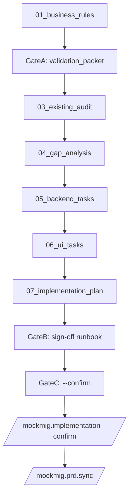
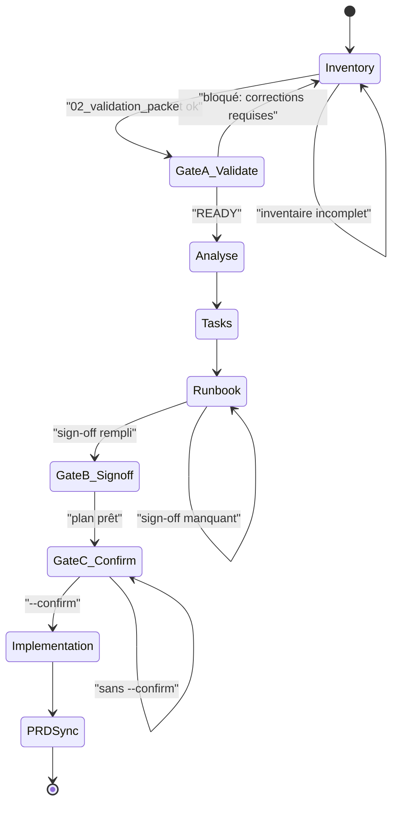

## Migration de maquettes — Workflow `mockmig.*`

### Sommaire
- [Objectif](#objectif)
- [TL;DR (à retenir)](#tldr-à-retenir)
- [Décision rapide (graphique)](#décision-rapide-graphique)
- [Paramètres](#paramètres)
- [Chemins mockupPath acceptés (table)](#chemins-mockuppath-acceptés-table)
- [Démarrage rapide (3 minutes)](#démarrage-rapide-3-minutes)
- [Pipeline complet (graphique + gates)](#pipeline-complet-graphique--gates)
- [Gates (ce qui bloque réellement)](#gates-ce-qui-bloque-réellement)
- [Étapes détaillées (par phase)](#étapes-détaillées-par-phase)
- [Structure des artefacts (graphique)](#structure-des-artefacts-graphique)
- [Artefacts générés (table)](#artefacts-générés-table)
- [Dépannage rapide](#dépannage-rapide)

## Objectif
Standardiser la migration d’une maquette vers un module produit, **sans perdre de règles métier**, en générant des artefacts dans `migration/{module}/` :

- **Inventaire** des règles métier (module + composants)
- **Gate de validation** (STOP obligatoire)
- **Audit** read-only de l’existant
- **Gap analysis**
- **Tâches** backend + UI
- **Runbook** d’implémentation + sign-off

## TL;DR (à retenir)
- **Commencer** : `/mockmig.start ...`
- **Savoir quoi faire ensuite** : `/mockmig.status ...` (affiche **NEXT** + **READY**)
- **Modules complexes** : si `<mockupPath>/src/components/*` existe → inventaire **par composant obligatoire**

> Règle d’or : si tu hésites, lance `/mockmig.status` — il te donne **la prochaine commande** + si tu es **READY** ou **bloqué** (avec les raisons).

> Pré-vol (recommandé) : lance `/mockmig.doctor` pour vérifier que le runtime `.mockmig/` (scripts/templates) et les sources de vérité (constitution / sécurité / ontologie) sont présents.

## Décision rapide (graphique)

```mermaid
flowchart TD
  start[/mockmig.start/]
  detect{src/components existe ?}
  simple[Cas module simple]
  complex[Cas module complexe]
  start --> detect
  detect -->|non| simple
  detect -->|oui| complex
  simple --> invM[/mockmig.inventory (module)/]
  complex --> invM
  invM --> valM[/mockmig.validate (module)/]
  valM --> initC[/mockmig.components.init/]
  initC --> loopC[Pour chaque composant]
  loopC --> runC[/mockmig.component.run --component X/]
  runC --> loopC
```

### Pipeline comparatif (graphique)

```mermaid
flowchart LR
  subgraph simplePath [Cas_module_simple]
    s0[/start/] --> s1[/inventory/] --> s2[/validate/]
    s2 --> s3[/audit/] --> s4[/gap/] --> s5[/backend.tasks/]
    s5 --> s6[/ui.tasks/] --> s7[/plan/] --> s8[/implementation --confirm/]
    s8 --> s9[/prd.sync/]
  end
  subgraph complexPath [Cas_module_complexe]
    c0[/start/] --> c1[/inventory(module)/] --> c2[/validate(module)/]
    c2 --> c3[/components.init/]
    c3 --> c4["Boucle_par_composant"]
    c4 --> c5[/inventory(component)/] --> c6[/validate(component)/]
    c6 --> c7[/audit/] --> c8[/gap/]
    c8 --> c9[/backend.tasks/] --> c10[/ui.tasks/]
    c10 --> c11[/plan/] --> c12[/implementation --confirm/]
    c12 --> c13[/prd.sync/]
    c6 --> c4
  end
```

## Sources de vérité (NON négociables)
- `memory/constitution.md`
- `security/ARCHITECTURE_DE_SECURITÉ.md`
- `ontologie/01_ontologie.md` + `ontologie/02_ontologie.yaml`
- (si impact utilisateurs) `RAPPORT_ANALYSE_STRUCTURE_UTILISATEURS.md`

## Paramètres

### Paramètres communs
- **`--module <slug>`** : nom du module cible (sert aussi au dossier `migration/{module}/`)
  - format: minuscules, chiffres, tirets (ex: `devis`, `ma-place-rh`)
- **`--mockupPath <path>`** : chemin **relatif au repo** vers la maquette
- **`--component <slug>`** *(optionnel)* : scoper à un composant
- **`--force`** *(optionnel)* : réinitialiser les sorties

### Chemins `mockupPath` acceptés (table)

| Cas | Pattern | Exemple |
|---|---|---|
| **Défaut** | `modules/maquette/<module>/...` | `modules/maquette/devis/v1` |
| **Maquette dans le module** | `modules/<module>/maquette/...` | `modules/ma-place-rh/maquette/v1` |

## Démarrage rapide (3 minutes)

### 1) Démarrer (point d’entrée)

```text
/mockmig.start --module devis --mockupPath modules/maquette/devis/v1
```

### 2) Inventaire (exhaustif)

Inventaire **module** :

```text
/mockmig.inventory --module devis --mockupPath modules/maquette/devis/v1
```

Si le module est **complexe** (composants détectés), inventaire **par composant** :

```text
/mockmig.inventory --module devis --mockupPath modules/maquette/devis/v1 --component evaluations
```

### 3) Gate de validation (STOP)

```text
/mockmig.validate --module devis --mockupPath modules/maquette/devis/v1
```

### À tout moment : NEXT/READY

```text
/mockmig.status --module devis --mockupPath modules/maquette/devis/v1
```

## Pipeline complet (graphique + gates)



### Gates (state machine)



### Gates (ce qui bloque réellement)
- **Gate A — `validate`** : sans `02_validation_packet.md` validé → pas d’audit/gap/tasks/plan/implémentation.
- **Gate B — sign-off runbook** : sans sign-off rempli dans `07_implementation_plan.md` → pas d’implémentation.
- **Gate C — `--confirm`** : l’implémentation ne doit jamais tourner sans `--confirm`.

### Exemple de sortie attendue (NEXT/READY)

```text
NEXT: /mockmig.validate --module devis --mockupPath modules/maquette/devis/v1
READY: false
BLOCKERS:
- 01_business_rules.md manquant
- module complexe: inventaires composant manquants (components/*/01_business_rules.md)
```

## Étapes détaillées (par phase)

### Phase 0 — Orchestrateurs (facultatif)
- `/mockmig.run --module <slug> --mockupPath <path>` : propose des handoffs
- `/mockmig.component.run --module <slug> --mockupPath <path> --component <c>` : pipeline complet composant

> Recommandé: commence par `/mockmig.start`, puis utilise `/mockmig.status` pour suivre.

### Phase 1 — Inventaire (zéro perte)
- Module: `/mockmig.inventory --module <slug> --mockupPath <path>`
- Composant (si complexe): `/mockmig.inventory ... --component <c>`

Checklist inventaire (module + composants) :
- [ ] Règles de validation par champ (formats, min/max, dépendances)
- [ ] États & transitions (draft/published, etc.)
- [ ] Règles de visibilité (roles, conditions)
- [ ] Calculs / agrégations / montants
- [ ] Erreurs / messages / cas limites
- [ ] Contrainte “source de vérité” (références, IDs, nomenclatures)

### Phase 2 — Validation (STOP)
- `/mockmig.validate --module <slug> --mockupPath <path>`

### Phase 3 — Si complexe : scaffold composants
- `/mockmig.components.init --module <slug> --mockupPath <path>`

### Phase 4 — Analyse
- `/mockmig.audit --module <slug> --mockupPath <path> [--component <c>]`
- `/mockmig.gap --module <slug> --mockupPath <path> [--component <c>]`

### Phase 5 — Tâches
- `/mockmig.backend.tasks --module <slug> --mockupPath <path> [--component <c>]`
- `/mockmig.ui.tasks --module <slug> --mockupPath <path> [--component <c>]`

### Phase 6 — Runbook
- `/mockmig.plan --module <slug> --mockupPath <path> [--component <c>]`
- `/mockmig.plan.regen --plan migration/<module>/[components/<c>/]07_implementation_plan.md`

### Phase 7 — Implémentation (dangereux)
- `/mockmig.implementation --plan migration/<module>/[components/<c>/]07_implementation_plan.md --confirm`
- puis (recommandé): `/mockmig.prd.sync --plan ...`

## Structure des artefacts (graphique)

```text
migration/<module>/
  00_context.md
  00_component_map.md          (si complexe)
  01_business_rules.md
  02_validation_packet.md
  03_existing_audit.md
  04_gap_analysis.md
  05_backend_tasks.md
  06_ui_tasks.md
  07_implementation_plan.md
  components/                  (si complexe)
    <component>/
      00_context.md
      01_business_rules.md
      02_validation_packet.md
      03_existing_audit.md
      04_gap_analysis.md
      05_backend_tasks.md
      06_ui_tasks.md
      07_implementation_plan.md
```

## Artefacts générés (table)

| Phase | Fichier | Rôle |
|---|---|---|
| Context | `00_context.md` | Contexte module/maquette/scope |
| Map (si complexe) | `00_component_map.md` | Cartographie des composants |
| Inventaire | `01_business_rules.md` | Catalogue règles métier + mapping |
| Gate | `02_validation_packet.md` | Décisions + validation amont |
| Audit | `03_existing_audit.md` | Existant (DB/RLS/API/UI/docs) |
| Gap | `04_gap_analysis.md` | Écarts priorisés P0/P1/P2 |
| Tasks | `05_backend_tasks.md` | DB/RLS/API/tests/docs |
| Tasks | `06_ui_tasks.md` | UI/validations/guards/tests UI |
| Runbook | `07_implementation_plan.md` | Checklist + sign-off + journal |

## Dépannage rapide
- **Je suis perdu** : `/mockmig.status --module <slug> --mockupPath <path>` → suis **NEXT/READY**.
- **mockupPath invalide** : vérifie la table des patterns plus haut.
- **Je veux repartir de zéro** : relance avec `--force`.